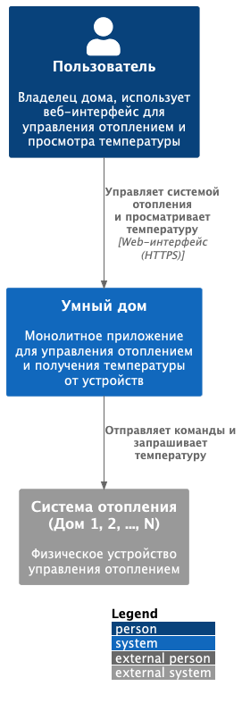
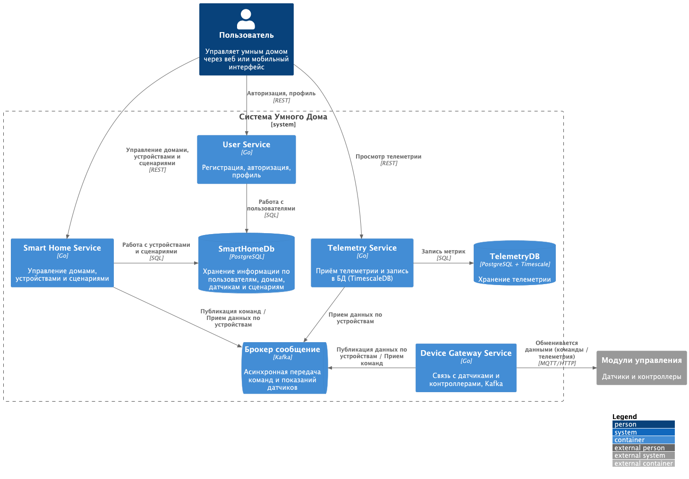
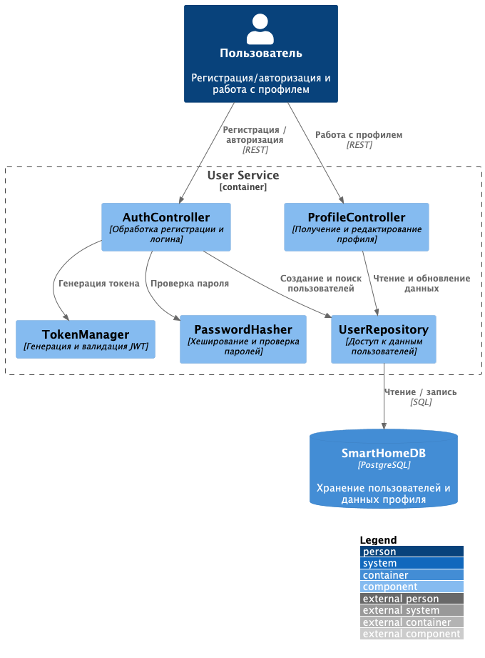
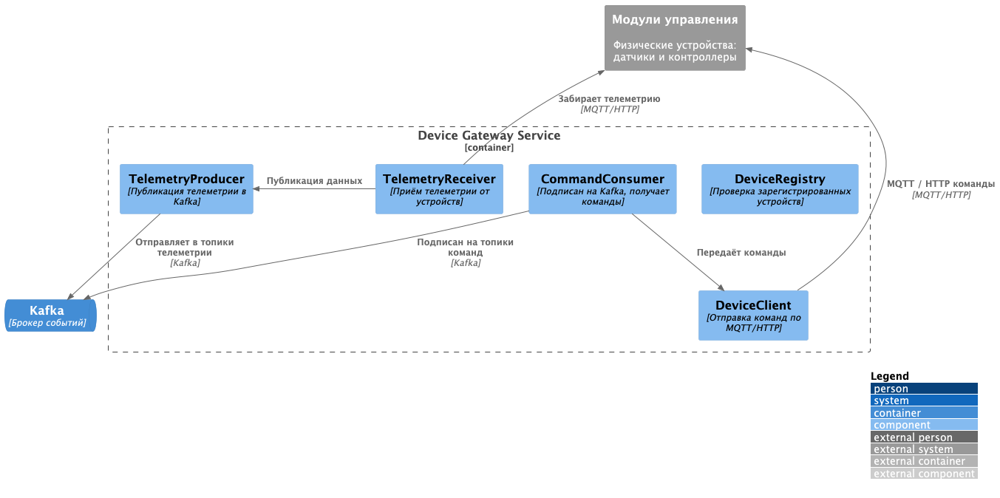
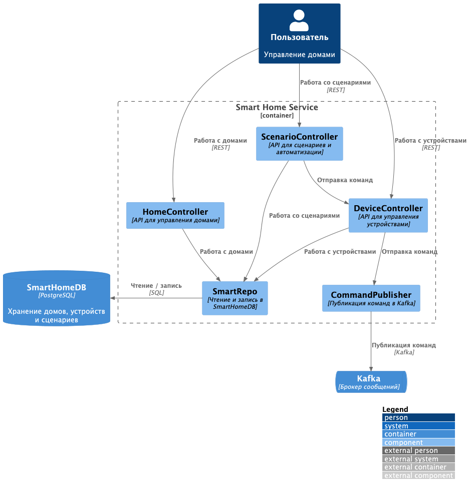
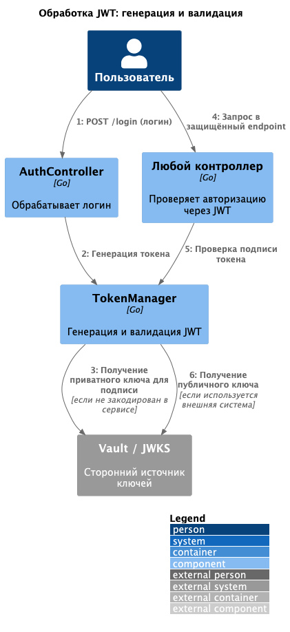
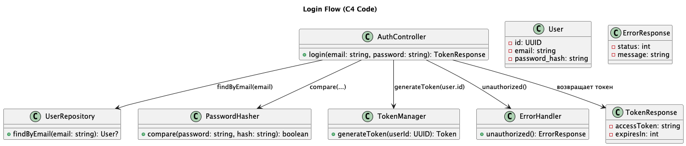

# Умный дом

Это шаблон для решения проектной работы. Структура этого файла повторяет структуру заданий. Заполняйте его по мере
работы над решением.

# Задание 1. Анализ и планирование

## 1. Описание функциональности монолитного приложения

### Управление отоплением:

- Пользователи могут удалённо включать и выключать отопление в своих домах.
- Управление устройствами осуществляется централизованно через сервер «Умный дом».
- Подключение оборудования возможно только вручную, с выездом специалиста.

### Мониторинг температуры:

- Пользователи могут просматривать текущую температуру в своём доме через веб-интерфейс.
- Система получает данные с датчиков путём опроса (pull-модель) — сервер сам делает запросы к устройствам.
- Поддержка реактивного взаимодействия (подписки, событий) отсутствует.

---

## 2. Анализ архитектуры монолитного приложения

- **Язык программирования:** Go
- **База данных:** PostgreSQL
- **Тип архитектуры:** Монолитная
- **Характер взаимодействия:** Синхронный, централизованный вызов из сервера ко всем устройствам и компонентам.
- **Развёртывание:** Любые изменения требуют полной остановки и перезапуска приложения.
- **Связь с устройствами:** Напрямую от сервера к каждому модулю отопления.
- **Подключение новых устройств:** Только вручную, без самообслуживания.

---

## 3. Определение доменов и границы контекстов

Выделены следующие предметные области (домены):

- **Пользователи (User):** регистрация, доступ, управление домом.
- **Дома (House):** логические объекты, к которым привязаны устройства.
- **Устройства (Device):** оборудование (отопление, датчики температуры).
- **Типы устройств (DeviceType):** классификация оборудования.
- **Телеметрия (Telemetry):** данные, поступающие от устройств.
- **Управление отоплением (HeatingControl):** команды на устройства.
- **Provisioning:** первичная регистрация и установка оборудования.

---

## 4. Проблемы монолитного решения

- Слабая масштабируемость — нельзя независимо масштабировать части системы.
- Отсутствие событийной модели — нет подписки на телеметрию или аварийные сигналы.
- Высокая связность компонентов — изменение одной части затрагивает всё приложение.
- Сложность разработки — любая новая функция требует вмешательства в общий код.
- Отсутствие самообслуживания — устройства нельзя подключить без специалиста.
- Низкая надёжность — сбой одного компонента может повлиять на всю систему.

---

## 5. Визуализация контекста системы — диаграмма С4

Диаграмма контекста (C4 Level 1) отражает текущее состояние системы:

- Пользователи взаимодействуют с системой через веб-интерфейс.
- Сервер «Умный дом» обрабатывает команды, управляет устройствами, получает телеметрию.
- Каждое устройство подключено напрямую к серверу.
- Устройства не являются активными участниками системы — данные поступают только по запросу.

)

---

# Задание 2. Проектирование микросервисной архитектуры

---

## Диаграмма контейнеров (C4: Container)



Описание связей между контейнерами:

- **user → user-service**: выполняет регистрацию и аутентификацию.
- **user → smart-home-service**: управляет домами, сценариями и устройствами через REST.
- **user → telemetry-service**: получает отображение телеметрии.
- **user-service → smartHomeDb**: читает и записывает данные пользователей.
- **smart-home-service → smartHomeDb**: работает с домами, устройствами и правилами.
- **telemetry-service → telemetryDb**: пишет телеметрию в TimescaleDB.
- **smart-home-service → Kafka**: публикует команды управления устройствами и подписан на телеметрию.
- **device-gateway-service → Kafka**: подписан на команды и публикует телеметрию.
- **telemetry-service → Kafka**: подписан на телеметрию.
- **device-gateway-service ↔ модули управления**: физически управляет устройствами, отправляя команды и получая данные
  по MQTT/HTTP.

Примечание

- В текущей версии выбраны **4 сервиса**, соответствующие основным доменам: пользователи, устройства, телеметрия и
  бизнес-логика дома.
- В будущем планируется **декомпозиция** `smart-home-service`:
    - на `scenario-service` (автоматизация и правила),
    - `device-service` (работа с виртуальными устройствами и их типами),
    - `house-service` (информация о доме, зонах, ролях и т.п.).

- Kafka используется как **брокер сообщений** для событийной интеграции между логикой дома и устройствами.

- На диаграмме **не отображён frontend** по следующим причинам:
    - В задаче нет описания его реализации — не указано, реализован ли он как SPA, SSR или серверный монолит.
    - Предположительно, пользователь взаимодействует с фронтом, встроенным в `smart-home-service` (если он серверный), и
      тот уже вызывает остальные сервисы по REST.
    - В случае, если позже появится выделенный фронтенд, он может быть оформлен как отдельный контейнер (`frontend` или
      `web-app`) с REST-вызовами в `user-service`, `telemetry-service`, `smart-home-service`.

---

## Диаграмма компонентов

---

### Компонент: User Service



Описание связей:

- `AuthController` обрабатывает запросы регистрации и входа, взаимодействует с `UserRepository`, `PasswordHasher` и
  `TokenManager`.
- `ProfileController` получает и изменяет пользовательские данные, используя `UserRepository`.
- `UserRepository` работает с таблицами пользователей в базе `SmartHomeDB`.
- Все компоненты находятся в границах одного контейнера `user-service`.

Примечание:

- JWT показан условно через `TokenManager`, но:
    - неизвестно, реализована ли сейчас поддержка JWT;
    - не раскрывается, используется ли внешнее хранилище ключей (например, Vault) или Redis для хранения сессий.
- Внутренние детали `AuthController` и `ProfileController` не раскрываются: предполагается, что они содержат простую
  бизнес-логику.
- Работа с аватарами (загрузка, хранение файлов) здесь **не показана**, так как в проекте не указано, реализована ли эта
  функциональность и через какой сервис она идёт.

---

### Компонент: Device Gateway Service



Описание связей:

- `CommandConsumer` подписан на Kafka-топики с командами от `smart-home-service`.
- `DeviceClient` передаёт команды на физические устройства.
- `TelemetryReceiver` принимает телеметрию от устройств через MQTT/HTTP.
- `TelemetryProducer` публикует полученные данные в Kafka.
- `DeviceRegistry` используется для проверки корректности ID устройств, но в диаграмме не раскрыт его источник данных (
  например, Redis).

Примечание:

- `deviceRegistry` может использовать Redis или внутренний кеш — не показано, так как не указано, реализовано ли это.
- Протоколы обмена с устройствами указаны как MQTT/HTTP, но допускается расширение.
- Сервис не содержит бизнес-логики, а выполняет роль шлюза между Kafka и физическими устройствами.

---

### Компонент: Telemetry Service


Описание связей:

- `TelemetryConsumer` читает сообщения из Kafka, содержащие данные с устройств.
- `TelemetryValidator` проверяет структуру данных, фильтрует ошибки.
- `TelemetryRepository` сохраняет данные в TimescaleDB и формирует SQL-запросы по запросу клиента.
- `TelemetryController` предоставляет REST API для клиентских приложений (просмотр, фильтрация, агрегаты).

Примечание:

- В TimescaleDB данные записываются в режиме реального времени.
- Все SQL-запросы формируются непосредственно в `TelemetryRepository`, отдельного `QueryBuilder` не требуется.

---

### Компонент: Smart Home Service



Описание связей:

- `HomeController`, `DeviceController`, `ScenarioController` — реализуют клиентское API.
- `SmartRepo` — универсальный слой работы с PostgreSQL, обслуживает все бизнес-сущности.
- `CommandPublisher` — отдельный компонент для отправки команд через Kafka.

Примечание:

- Все команды на устройства отправляются асинхронно через Kafka.
- Реализация сценариев предполагает запуск по событиям или расписанию — пока не уточнено.

---

## Диаграммы кода (Code)

---

### Code: JWTToken



Примечания:

- TokenManager — это обёртка, которая:
- при генерации использует приватный ключ (может быть встроен или получен из Vault),
- при валидации — публичный ключ.
- Источник ключей (Vault или JWKS) не раскрыт в условиях — добавлен условно.
- JWT-токен может содержать user_id, scope/role и срок действия (exp).
- На диаграмме один контроллер, но на практике каждый микросервисный контроллер обращается к TokenManager.

---

### Code: Login Flow



Примечания:

- Другой вариант диаграммы Code
---

# Задание 3. Разработка ER-диаграммы

Добавьте сюда ER-диаграмму. Она должна отражать ключевые сущности системы, их атрибуты и тип связей между ними.

# Задание 4. Создание и документирование API

### 1. Тип API

Укажите, какой тип API вы будете использовать для взаимодействия микросервисов. Объясните своё решение.

### 2. Документация API

Здесь приложите ссылки на документацию API для микросервисов, которые вы спроектировали в первой части проектной работы.
Для документирования используйте Swagger/OpenAPI или AsyncAPI.

# Задание 5. Работа с docker и docker-compose

Перейдите в apps.

Там находится приложение-монолит для работы с датчиками температуры. В README.md описано как запустить решение.

Вам нужно:

1) сделать простое приложение temperature-api на любом удобном для вас языке программирования, которое при запросе
   /temperature?location= будет отдавать рандомное значение температуры.

Locations - название комнаты, sensorId - идентификатор названия комнаты

```
	// If no location is provided, use a default based on sensor ID
	if location == "" {
		switch sensorID {
		case "1":
			location = "Living Room"
		case "2":
			location = "Bedroom"
		case "3":
			location = "Kitchen"
		default:
			location = "Unknown"
		}
	}

	// If no sensor ID is provided, generate one based on location
	if sensorID == "" {
		switch location {
		case "Living Room":
			sensorID = "1"
		case "Bedroom":
			sensorID = "2"
		case "Kitchen":
			sensorID = "3"
		default:
			sensorID = "0"
		}
	}
```

2) Приложение следует упаковать в Docker и добавить в docker-compose. Порт по умолчанию должен быть 8081

3) Кроме того для smart_home приложения требуется база данных - добавьте в docker-compose файл настройки для запуска
   postgres с указанием скрипта инициализации ./smart_home/init.sql

Для проверки можно использовать Postman коллекцию smarthome-api.postman_collection.json и вызвать:

- Create Sensor
- Get All Sensors

Должно при каждом вызове отображаться разное значение температуры

Ревьюер будет проверять точно так же.

# **Задание 6. Разработка MVP**

Необходимо создать новые микросервисы и обеспечить их интеграции с существующим монолитом для плавного перехода к
микросервисной архитектуре.

### **Что нужно сделать**

1. Создайте новые микросервисы для управления телеметрией и устройствами (с простейшей логикой), которые будут
   интегрированы с существующим монолитным приложением. Каждый микросервис на своем ООП языке.
2. Обеспечьте взаимодействие между микросервисами и монолитом (при желании с помощью брокера сообщений), чтобы
   постепенно перенести функциональность из монолита в микросервисы.

В результате у вас должны быть созданы Dockerfiles и docker-compose для запуска микросервисов. 